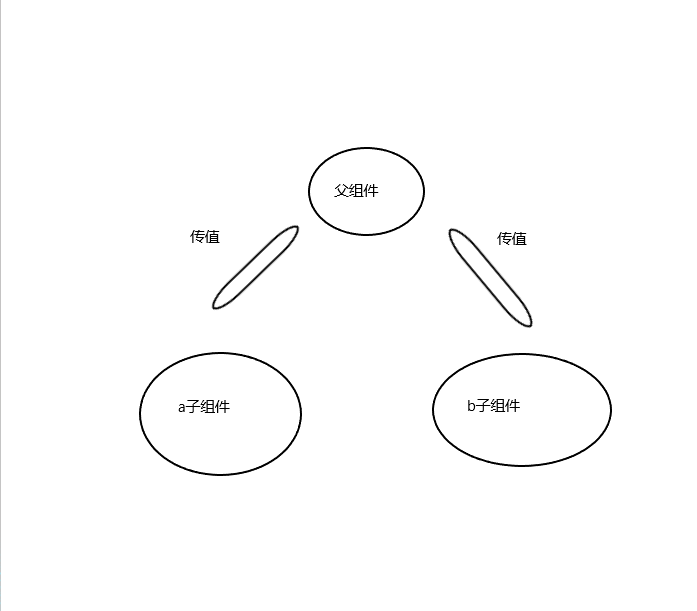

## react 学习笔记(基础)

+ 父组件向子组件传值
+ 子组件向父组件传值
+ react更新DOM树是通过底层diff方法来触发更新的,只更新改变部分,所以性能卓越
+ 有状态组件和无状态组件(函数式组件)
+ 组件和组件之间传值(a子组件传给父组件,父组件在传给b子组件)
    - 兄弟组件传递分析,所谓的兄弟节点传递就是,如下图所示
    - 
    - 先是父组件把一个值传递给b子组件,b组件通过props接收值,然后再在父组件定义一个方法onChangeLinkHome,
      在this.state里面定义数据,然后把该方法传给a子组件,a子组件定义一个函数,用来修改数据,然后传给父组件,
      即可实现 parent -> child b -> parent -> child a -> parent 组件之间通信
+ 双向数据绑定
+ 生命周期

